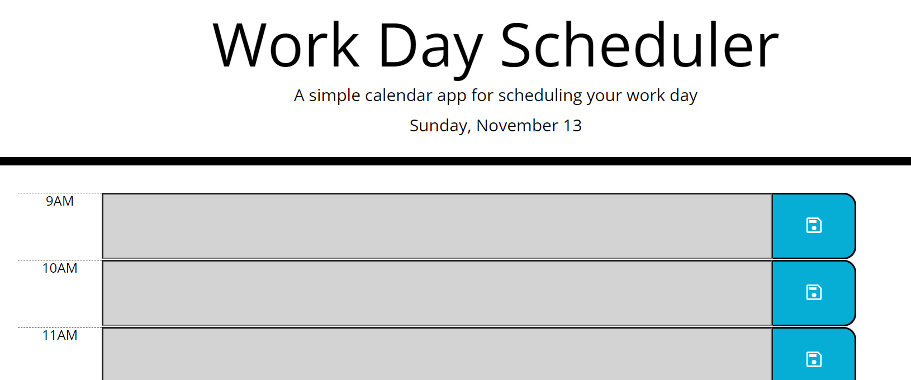

# Third-Party APIs
Challenge #5: Third-Party APIs

This challenge was to create a day planner based on normal business hours. With rows changing color based on time of day, and inputs being saved to localstorage

Link: https://mdinkelbach.github.io/work-day-scheduler
